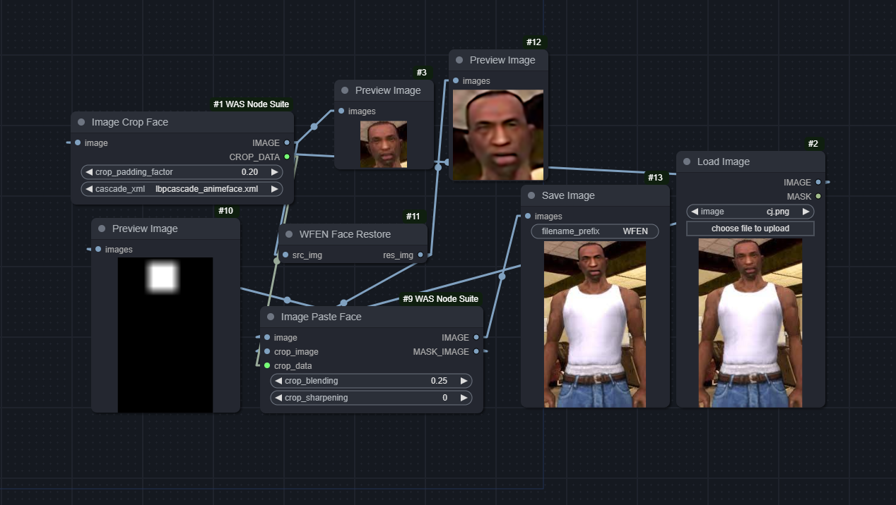
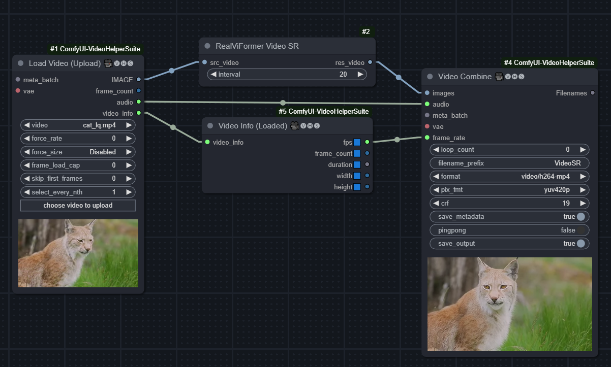

# FM_nodes

A collection of ComfyUI nodes. Including:
1. WFEN Face Restore, [Efficient Face Super-Resolution via Wavelet-based Feature Enhancement Network](https://github.com/PRIS-CV/WFEN)
2. [RealViformer](https://github.com/Yuehan717/RealViformer) - Investigating Attention for Real-World Video Super-Resolution

## Workflows

### WFEN

Download the model [here](https://github.com/PRIS-CV/WFEN?tab=readme-ov-file#getting-started) and place it in `models/wfen/WFEN.pth`.

[workflow_wfen_facecrop.json](workflow/workflow_wfen_facecrop.json)

### RealViformer

Download the model [here](https://github.com/Yuehan717/RealViformer?tab=readme-ov-file#usage) and place it in `models/realviformer/weights.pth`.

[workflow_realviformer.json](workflow/workflow_realviformer.json)

(Not a workflow-embedded image)