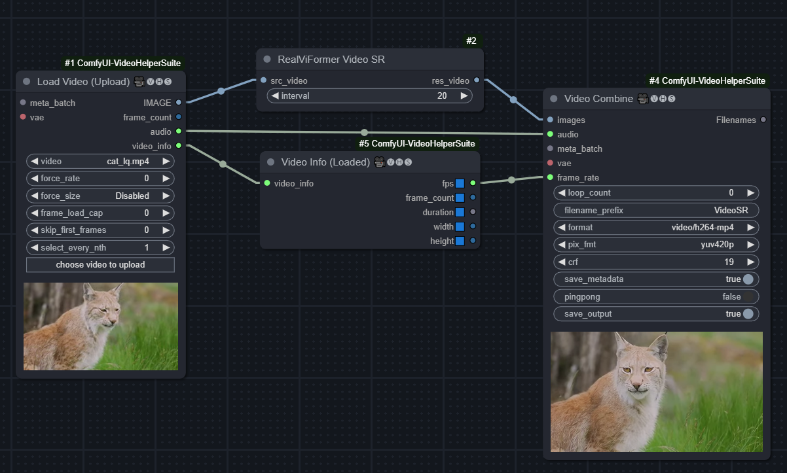
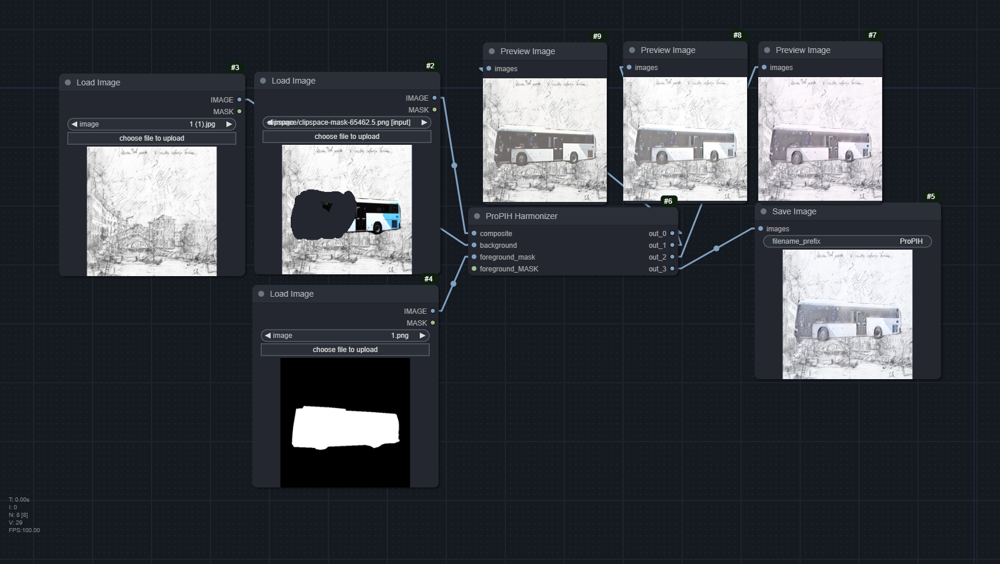
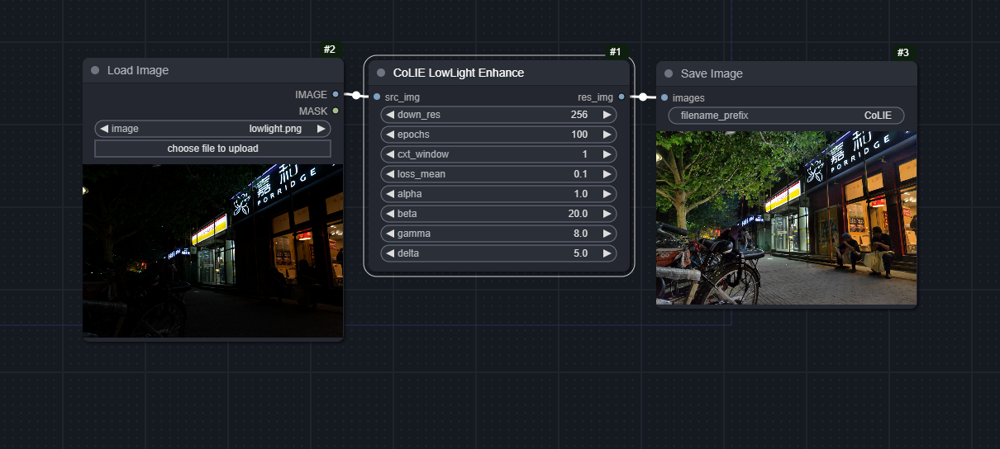
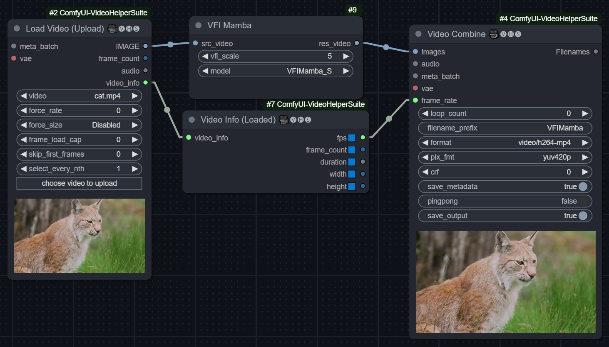
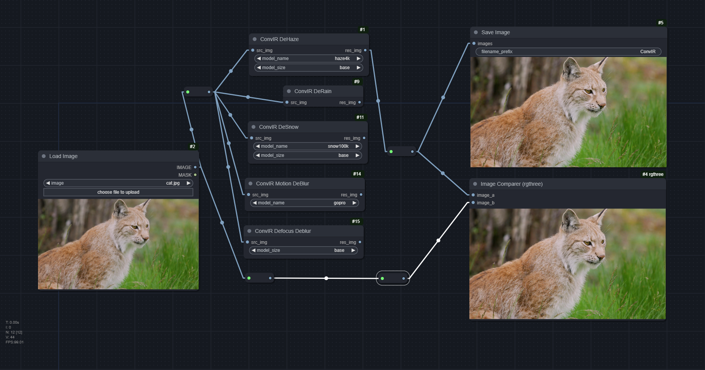
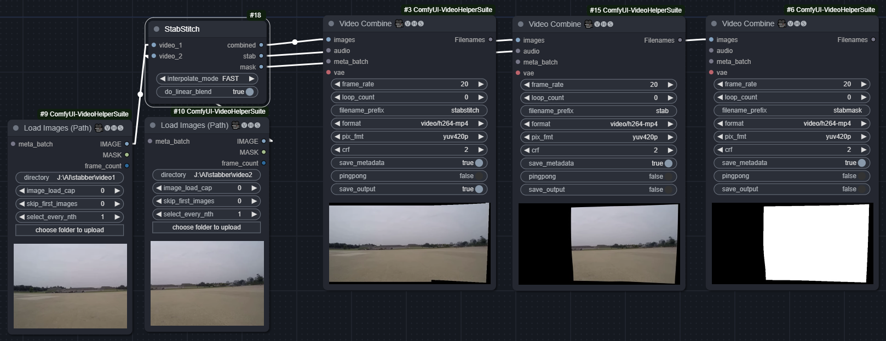
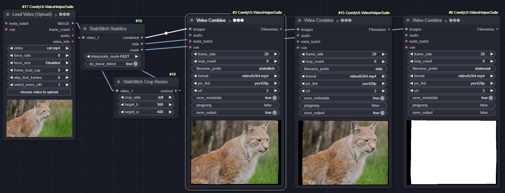

# FM_nodes

A collection of ComfyUI nodes.

Click name to jump to workflow
1. [**WFEN**](#wfen) Face Restore. Paper: [Efficient Face Super-Resolution via Wavelet-based Feature Enhancement Network](https://github.com/PRIS-CV/WFEN)
2. [**RealViformer**](#realviformer) - Paper: [Investigating Attention for Real-World Video Super-Resolution](https://github.com/Yuehan717/RealViformer)
3. [**ProPIH**](#propih). Paper: [Progressive Painterly Image Harmonization from Low-level Styles to High-level Styles](https://github.com/bcmi/ProPIH-Painterly-Image-Harmonization)
4. [**CoLIE**](#colie). Paper: [Fast Context-Based Low-Light Image Enhancement via Neural Implicit Representations](https://github.com/ctom2/colie)
5. [**VFIMamba**](#vfimamba). Paper: [Video Frame Interpolation with State Space Models](https://github.com/MCG-NJU/VFIMamba)
6. [**ConvIR**](#convir). Paper: [Revitalizing Convolutional Network for Image Restoration](https://github.com/c-yn/ConvIR)
7. [**StabStitch**](#stabstitch). Paper: [Eliminating Warping Shakes for Unsupervised Online Video Stitching](https://github.com/nie-lang/StabStitch)


## Workflows

### WFEN

Download the model [here](https://github.com/PRIS-CV/WFEN?tab=readme-ov-file#getting-started) and place it in `models/wfen/WFEN.pth`.

[workflow_wfen_facecrop.json](workflow/workflow_wfen_facecrop.json)


### RealViformer

Download the model [here](https://github.com/Yuehan717/RealViformer?tab=readme-ov-file#usage) and place it in `models/realviformer/weights.pth`.

[workflow_realviformer.json](workflow/workflow_realviformer.json)



(Not a workflow-embedded image)

https://github.com/user-attachments/assets/e89003c0-7be5-4263-b281-fd609807cea1

RealViFormer upscale example

### ProPIH

Download the `vgg_normalised.pth` model in the [Installation section](https://github.com/bcmi/ProPIH-Painterly-Image-Harmonization?tab=readme-ov-file#installation) and `latest_net_G.pth` in the [Train/Test section](https://github.com/bcmi/ProPIH-Painterly-Image-Harmonization?tab=readme-ov-file#propih-traintest)

```
models/propih/vgg_normalised.pth
models/propih/latest_net_G.pth
```

[workflow_propih.json](workflow/workflow_realviformer.json)



### CoLIE

No model needed to be downloaded. Lower `loss_mean` seems to result in brighter images. Node works with image and batched/video.

[workflow_colie_lowlight.json](workflow/workflow_colie_lowlight.json)



### VFIMamba

Download the models from the [huggingface page](https://huggingface.co/MCG-NJU/VFIMamba/tree/main/ckpt)

```
models/vfimamba/VFIMamba_S.pkl
models/vfimamba/VFIMamba.pkl
```

You will need to install `mamba-ssm`, which does not have a prebuilt Windows binary. You will need:
1. [triton](https://github.com/triton-lang/triton). Prebuilt for `Python 3.10 and 3.11` can be found here: https://github.com/triton-lang/triton/issues/2881 - https://huggingface.co/madbuda/triton-windows-builds/tree/main
2. [causal-conv1d](https://github.com/Dao-AILab/causal-conv1d). Follow this post: https://github.com/NVlabs/MambaVision/issues/14#issuecomment-2232581078
3. [mamba-ssm](https://github.com/state-spaces/mamba). Follow this tutorial: https://blog.csdn.net/yyywxk/article/details/140420538. Fork that followed all the steps: https://github.com/FuouM/mamba-windows-build

I've built `mamba-ssm` for `Python 3.11, torch 2.3.0+cu121`, which can be obtained here: https://huggingface.co/FuouM/mamba-ssm-windows-builds/tree/main

To install, `pip install [].whl`

[workflow_vfi_mamba.json](workflow/workflow_vfi_mamba.json)



(Not a workflow-embedded image)

https://github.com/user-attachments/assets/be263cc3-a104-4262-899b-242e9802719e

VFIMamba Example (top: Original, bottom: 5X, 20FPS)

### ConvIR

Download models in the [Pretrained models - gdrive](https://github.com/c-yn/ConvIR?tab=readme-ov-file#pretrained-models) section

[workflow_convir.json](workflow/workflow_convir.json)



```
models\convir
│ deraining.pkl
│
├─defocus
│   dpdd-base.pkl
│   dpdd-large.pkl
│   dpdd-small.pkl
│
├─dehaze
│   densehaze-base.pkl
│   densehaze-small.pkl
│   gta5-base.pkl
│   gta5-small.pkl
│   haze4k-base.pkl
│   haze4k-large.pkl
│   haze4k-small.pkl
│   ihaze-base.pkl
│   ihaze-small.pkl
│   its-base.pkl
│   its-small.pkl
│   nhhaze-base.pkl
│   nhhaze-small.pkl
│   nhr-base.pkl
│   nhr-small.pkl
│   ohaze-base.pkl
│   ohaze-small.pkl
│   ots-base.pkl
│   ots-small.pkl
│
├─desnow
│   csd-base.pkl
│   csd-small.pkl
│   snow100k-base.pkl
│   snow100k-small.pkl
│   srrs-base.pkl
│   srrs-small.pkl
│
└─modeblur
    convir_gopro.pkl
    convir_rsblur.pkl
```

### StabStitch

Download all 3 models in the [Code - Pre-trained model](https://github.com/nie-lang/StabStitch?tab=readme-ov-file#pre-trained-model) section.

```
models/stabstitch/temporal_warp.pth
models/stabstitch/spatial_warp.pth
models/stabstitch/smooth_warp.pth
```

| StabStitch | StabStitch Stabilize |
|-|-|
| [stabstitch_stitch.json](workflow/stabstitch_stitch.json) (Example videos in `examples\stabstitch`) | [stabstich_stabilize.json](workflow/stabstitch_stabilize.json) |
|  |  | 

(Not workflow-embedded images)

## Credits

```
@misc{chobola2024fast,
      title={Fast Context-Based Low-Light Image Enhancement via Neural Implicit Representations}, 
      author={Tomáš Chobola and Yu Liu and Hanyi Zhang and Julia A. Schnabel and Tingying Peng},
      year={2024},
      eprint={2407.12511},
      archivePrefix={arXiv},
      primaryClass={cs.CV},
      url={https://arxiv.org/abs/2407.12511}, 
}
```

```
@misc{zhang2024vfimambavideoframeinterpolation,
      title={VFIMamba: Video Frame Interpolation with State Space Models}, 
      author={Guozhen Zhang and Chunxu Liu and Yutao Cui and Xiaotong Zhao and Kai Ma and Limin Wang},
      year={2024},
      eprint={2407.02315},
      archivePrefix={arXiv},
      primaryClass={cs.CV},
      url={https://arxiv.org/abs/2407.02315}, 
}
```

```
@article{cui2024revitalizing,
  title={Revitalizing Convolutional Network for Image Restoration},
  author={Cui, Yuning and Ren, Wenqi and Cao, Xiaochun and Knoll, Alois},
  journal={IEEE Transactions on Pattern Analysis and Machine Intelligence},
  year={2024},
  publisher={IEEE}
}

@inproceedings{cui2023irnext,
  title={IRNeXt: Rethinking Convolutional Network Design for Image Restoration},
  author={Cui, Yuning and Ren, Wenqi and Yang, Sining and Cao, Xiaochun and Knoll, Alois},
  booktitle={International Conference on Machine Learning},
  pages={6545--6564},
  year={2023},
  organization={PMLR}
}
```

```
@article{nie2024eliminating,
  title={Eliminating Warping Shakes for Unsupervised Online Video Stitching},
  author={Nie, Lang and Lin, Chunyu and Liao, Kang and Zhang, Yun and Liu, Shuaicheng and Zhao, Yao},
  journal={arXiv preprint arXiv:2403.06378},
  year={2024}
}
```